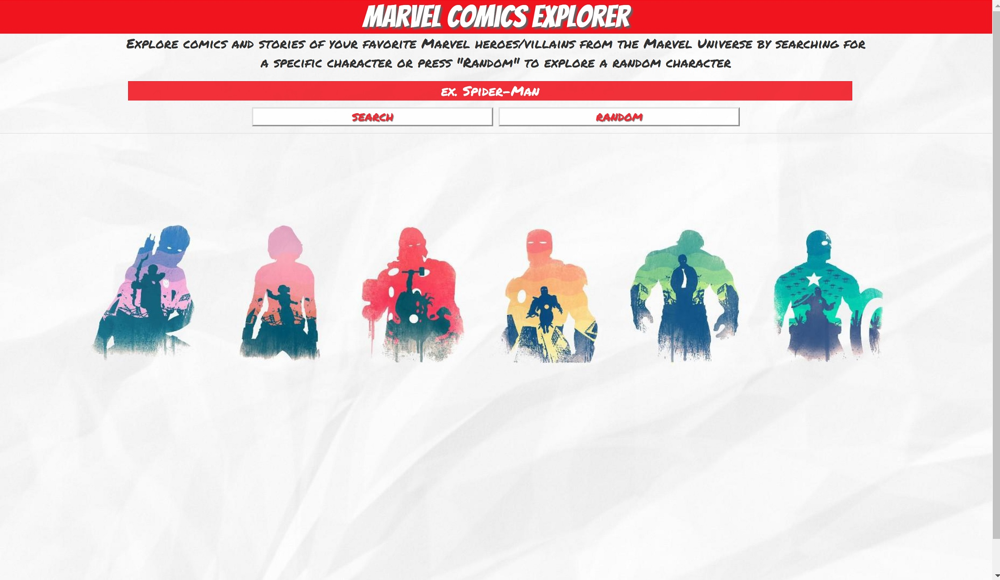
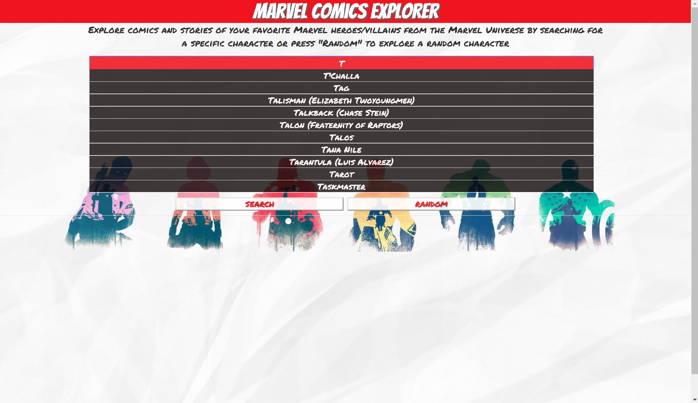
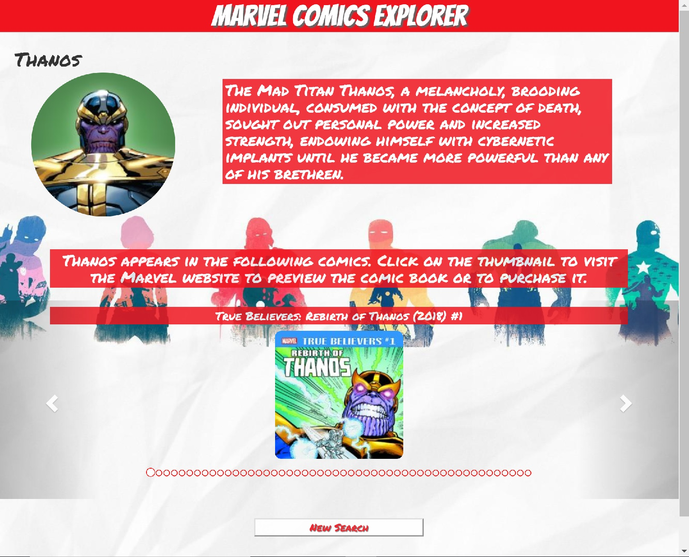
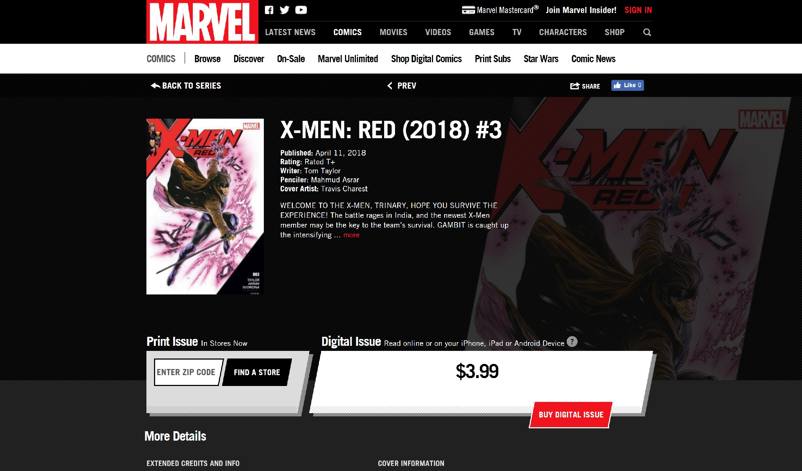

# Marvel Comics Explorer
Marvel Comics Explorer is an application designed to help introduce Marvel fans, or anyone in general, to the comic book versions of their favorite heroes or villains. 

## How it works
The application interface is fairly simple. The user has access to a search bar in which they can manually search for a specific character, or if they just start typing letters into the input field, they will be given character suggestions based on the letters they typed in. Alternatively, if the user doesn't know of any certain characters they are interested in, they can press the random button and get results for a randomly selected character.

Once the user finds a character, the application displays an image and a short description of the character (if it exists in the database). Most importantly, the application also returns a list of the available comic books that the character appears in. The user can scroll through the comic books list via the left and right arrows on the carousel or they can click on the circle indicators. Lastly, the user can click on the comic book image which will link them directly to the comic's page on the Marvel website where they can preview or purchase the digital issue, if it is available for purchase. 

## Demo
- [Marvel Comics Explorer](https://quexiong.github.io/MarvelComicsExplorer/)

## Screenshots
Landing page/Search page

Autosuggest/Autocomplete input feature

Display of search results

Comic page on Marvel Website

## API
- Marvel API

## Built With The Following 
- HTML 
- CSS
- JavaScript
- jQuery
- Bootstrap

## Cross Browser Compatibility/Responsiveness
- Google Chrome
- Mozilla Firefox
- Microsoft Edge
- Safari
- Responsive on tablet and mobile devices

## Web App Created By
Quentin Xiong

